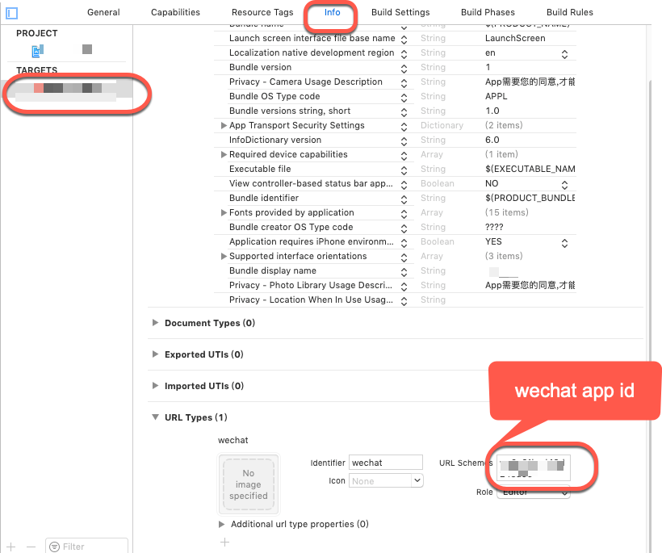

# @sesame/react-native-wechat

WeChat SDK wrapper for react native 0.60+, support iOS and android

# Why
[yorkie's react-native-wechat](https://github.com/yorkie/react-native-wechat) was unmaintaned for a long time,
with react native 0.60 release, that repo was unable to use.

This repo is ported and modified from yorkie's work.


## Table of Contents

- [Installation](#installation)
- [API Documentation](#api-documentation)
- [TODO](#todo)
- [License](#license)


## Installation

#### install package 
```sh
$ yarn add @sesame/react-native-wechat --save
$ cd ios && pod install && cd ..
```

#### configure iOS project
    
reference: [wechat sdk ios integrate guide](https://open.weixin.qq.com/cgi-bin/showdocument?action=dir_list&t=resource/res_list&verify=1&id=1417694084&token=&lang=zh_CN)

- Open your app xcode project, TARGETS->Info->URL Types->URL Schemas, input your
wechat app id.


#### configure android project

reference: [wechat sdk android integrate guide](https://open.weixin.qq.com/cgi-bin/showdocument?action=dir_list&t=resource/res_list&verify=1&id=1417751808&token=&lang=zh_CN)

- android/app/proguard-rules.pro
   
   copy following content to proguard file:
   ```
    -keep class com.tencent.mm.opensdk.** {
        *;
    }
    
    -keep class com.tencent.wxop.** {
        *;
    }
    ```
- android/app/src/main/java/YOUR/PACKAGE/PATH

    create file **wxapi/WXEntryActivity.java**
    ```
    package YOUR.PACKAGE.PATH.wxapi;
    
    import android.app.Activity;
    import android.os.Bundle;
    import cn.net.sesame.wechat.RNWechatModule;
    
    public class WXEntryActivity extends Activity {
      @Override
      protected void onCreate(Bundle savedInstanceState) {
        super.onCreate(savedInstanceState);
        RNWechatModule.handleIntent(getIntent());
        finish();
      }
    }
    ```
- android/app/src/main/AndroidManifest.xml

  add activey info:
  
  ```
    <activity
        android:name=".wxapi.WXEntryActivity"
        android:label="@string/app_name"
        android:theme="@android:style/Theme.Translucent.NoTitleBar"
        android:exported="true"
        android:taskAffinity="YOUR.PACKAGE.PATH"
        android:launchMode="singleTask">
      </activity>  
  ```
           
    

## API Documentation

[react-native-wechat] uses Promises, therefore you can use `Promise`
or `async/await` to manage your dataflow.

#### registerApp(appid)  

- `appid` {String} the appid you get from WeChat dashboard
- returns {Boolean} explains if your application is registered done

This method should be called once globally.

```js
import * as WeChat from 'react-native-wechat';

WeChat.registerApp('appid');
```

#### isWXAppInstalled() 

- returns {Boolean} if WeChat is installed.

Check if the WeChat app is installed on the device.


#### getApiVersion()

- returns {String} Contains the result.

Get the WeChat SDK api version.

#### openWXApp()

- returns {Boolean} 

Open the WeChat app from your application.

#### sendAuthRequest([scope[, state]])

- `scope` {Array|String} Scopes of auth request.
- `state` {String} the state of OAuth2
- returns {Object}

Send authentication request, and it returns an object with the 
following fields:

| field   | type   | description                         |
|---------|--------|-------------------------------------|
| errCode | Number | Error Code                          |
| errStr  | String | Error message if any error occurred |
| openId  | String |                                     |
| code    | String | Authorization code                  |
| url     | String | The URL string                      |
| lang    | String | The user language                   |
| country | String | The user country                    |

#### class `ShareMetadata`

- `type` {Number} type of this message. Can be {news|text|imageUrl|imageFile|imageResource|video|audio|file}
- `thumbImage` {String} Thumb image of the message, which can be a uri or a resource id.
- `description` {String} The description about the sharing.
- `webpageUrl` {String} Required if type equals `news`. The webpage link to share.
- `imageUrl` {String} Provide a remote image if type equals `image`.
- `videoUrl` {String} Provide a remote video if type equals `video`.
- `musicUrl` {String} Provide a remote music if type equals `audio`.
- `filePath` {String} Provide a local file if type equals `file`.
- `fileExtension` {String} Provide the file type if type equals `file`.

#### shareToTimeline(message)

- `message` {ShareMetadata} This object saves the metadata for sharing
- returns {Object}

Share a `ShareMetadata` message to timeline(朋友圈) and returns:

| name    | type   | description                         |
|---------|--------|-------------------------------------|
| errCode | Number | 0 if authorization successed        |
| errStr  | String | Error message if any error occurred |

The following examples require the 'react-native-chat' and 'react-native-fs' packages.

```js
import * as WeChat from 'react-native-wechat';
import fs from 'react-native-fs';
let resolveAssetSource = require('resolveAssetSource');

// Code example to share text message:
try {
  let result = await WeChat.shareToTimeline({
    type: 'text', 
    description: 'hello, wechat'
  });
  console.log('share text message to time line successful:', result);
} catch (e) {
  if (e instanceof WeChat.WechatError) {
    console.error(e.stack);
  } else {
    throw e;
  }
}

// Code example to share image url:
// Share raw http(s) image from web will always fail with unknown reason, please use image file or image resource instead
try {
  let result = await WeChat.shareToTimeline({
    type: 'imageUrl',
    title: 'web image',
    description: 'share web image to time line',
    mediaTagName: 'email signature',
    messageAction: undefined,
    messageExt: undefined,
    imageUrl: 'http://www.ncloud.hk/email-signature-262x100.png'
  });
  console.log('share image url to time line successful:', result);
} catch (e) {
  if (e instanceof WeChat.WechatError) {
    console.error(e.stack);
  } else {
    throw e;
  }
}

// Code example to share image file:
try {
  let rootPath = fs.DocumentDirectoryPath;
  let savePath = rootPath + '/email-signature-262x100.png';
  console.log(savePath);
  
  /*
   * savePath on iOS may be:
   *  /var/mobile/Containers/Data/Application/B1308E13-35F1-41AB-A20D-3117BE8EE8FE/Documents/email-signature-262x100.png
   *
   * savePath on Android may be:
   *  /data/data/com.wechatsample/files/email-signature-262x100.png
   **/
  await fs.downloadFile('http://www.ncloud.hk/email-signature-262x100.png', savePath);
  let result = await WeChat.shareToTimeline({
    type: 'imageFile',
    title: 'image file download from network',
    description: 'share image file to time line',
    mediaTagName: 'email signature',
    messageAction: undefined,
    messageExt: undefined,
    imageUrl: "file://" + savePath // require the prefix on both iOS and Android platform
  });
  console.log('share image file to time line successful:', result);
} catch (e) {
  if (e instanceof WeChat.WechatError) {
    console.error(e.stack);
  } else {
    throw e;
  }
}

// Code example to share image resource:
try {
  let imageResource = require('./email-signature-262x100.png');
  let result = await WeChat.shareToTimeline({
    type: 'imageResource',
    title: 'resource image',
    description: 'share resource image to time line',
    mediaTagName: 'email signature',
    messageAction: undefined,
    messageExt: undefined,
    imageUrl: resolveAssetSource(imageResource).uri
  });
  console.log('share resource image to time line successful', result);
}
catch (e) {
  if (e instanceof WeChat.WechatError) {
    console.error(e.stack);
  } else {
    throw e;
  }
}

// Code example to download an word file from web, then share it to WeChat session
// only support to share to session but time line
// iOS code use DocumentDirectoryPath
try {
  let rootPath = fs.DocumentDirectoryPath;
  let fileName = 'signature_method.doc';
  /*
   * savePath on iOS may be:
   *  /var/mobile/Containers/Data/Application/B1308E13-35F1-41AB-A20D-3117BE8EE8FE/Documents/signature_method.doc
   **/ 
  let savePath = rootPath + '/' + fileName;

  await fs.downloadFile('https://open.weixin.qq.com/zh_CN/htmledition/res/assets/signature_method.doc', savePath);
  let result = await WeChat.shareToSession({
    type: 'file',
    title: fileName, // WeChat app treat title as file name
    description: 'share word file to chat session',
    mediaTagName: 'word file',
    messageAction: undefined,
    messageExt: undefined,
    filePath: savePath,
    fileExtension: '.doc'
  });
  console.log('share word file to chat session successful', result);
} catch (e) {
  if (e instanceof WeChat.WechatError) {
    console.error(e.stack);
  } else {
    throw e;
  }
}

//android code use ExternalDirectoryPath
try {
  let rootPath = fs.ExternalDirectoryPath;
  let fileName = 'signature_method.doc';
  /*
   * savePath on Android may be:
   *  /storage/emulated/0/Android/data/com.wechatsample/files/signature_method.doc
   **/
  let savePath = rootPath + '/' + fileName;
  await fs.downloadFile('https://open.weixin.qq.com/zh_CN/htmledition/res/assets/signature_method.doc', savePath);
  let result = await WeChat.shareToSession({
    type: 'file',
    title: fileName, // WeChat app treat title as file name
    description: 'share word file to chat session',
    mediaTagName: 'word file',
    messageAction: undefined,
    messageExt: undefined,
    filePath: savePath,
    fileExtension: '.doc'
  });
  console.log('share word file to chat session successful', result);
}
catch (e) {
  if (e instanceof WeChat.WechatError) {
    console.error(e.stack);
  } else {
    throw e;
  }
}
```

#### shareToSession(message)

- `message` {ShareMetadata} This object saves the metadata for sharing
- returns {Object}

Similar to `shareToTimeline` but sends the message to a friend or chat group.

#### pay(payload)

- `payload` {Object} the payment data
  - `partnerId` {String} 商家向财付通申请的商家ID
  - `prepayId` {String} 预支付订单ID
  - `nonceStr` {String} 随机串
  - `timeStamp` {String} 时间戳
  - `package` {String} 商家根据财付通文档填写的数据和签名
  - `sign` {String} 商家根据微信开放平台文档对数据做的签名
- returns {Object}

Sends request for proceeding payment, then returns an object:

| name    | type   | description                         |
|---------|--------|-------------------------------------|
| errCode | Number | 0 if authorization successed        |
| errStr  | String | Error message if any error occurred |

## Todo

- [ ] test each api
- [ ] add api usage in example project

## License

MIT
